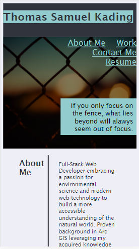
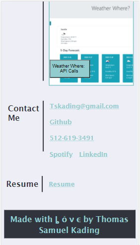
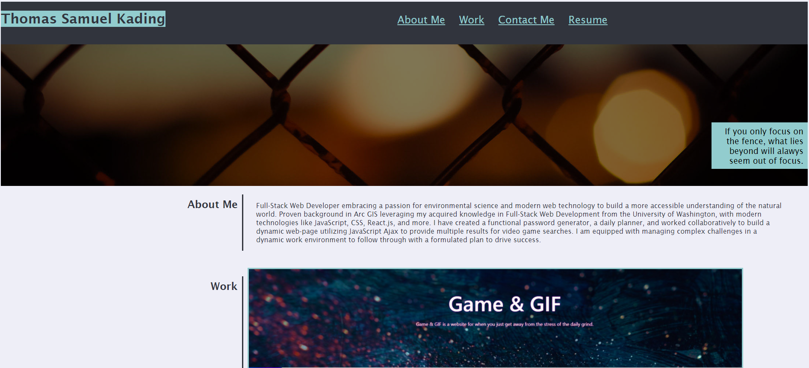
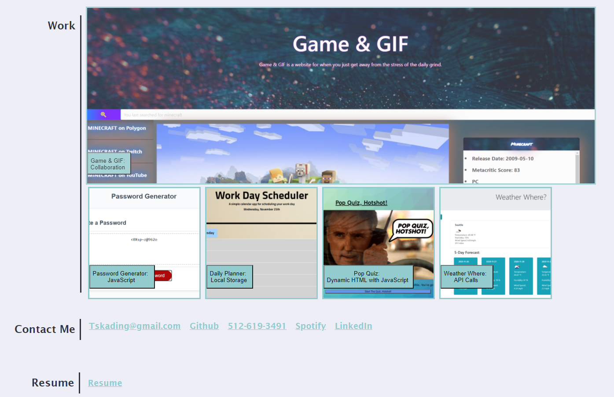

# Portfolio
Everything you need to know about me on a professional level.  Here you can browse some of my favorite projects, check out my Github, peruse my resume, and even see what music I'm listening to on Spotify while I code.  

# Quick Notes
My portfolio page utilizes html and css to create a one stop page with all of the professional information you need to learn about me - Thomas Samuel Kading.  The nav-links in the header will quickly jump you to any section of information, espically useful in mobile.  As for the remaining information, clicking on the images of the projects will take you to the live page, and the text button contained within will provide you with a link to that specific Github page.  

# Screenshots and Live Page Link
[This will take you to my live Portfolio page if you click on it.](https://tskading.github.io/Portfolio/)

 

